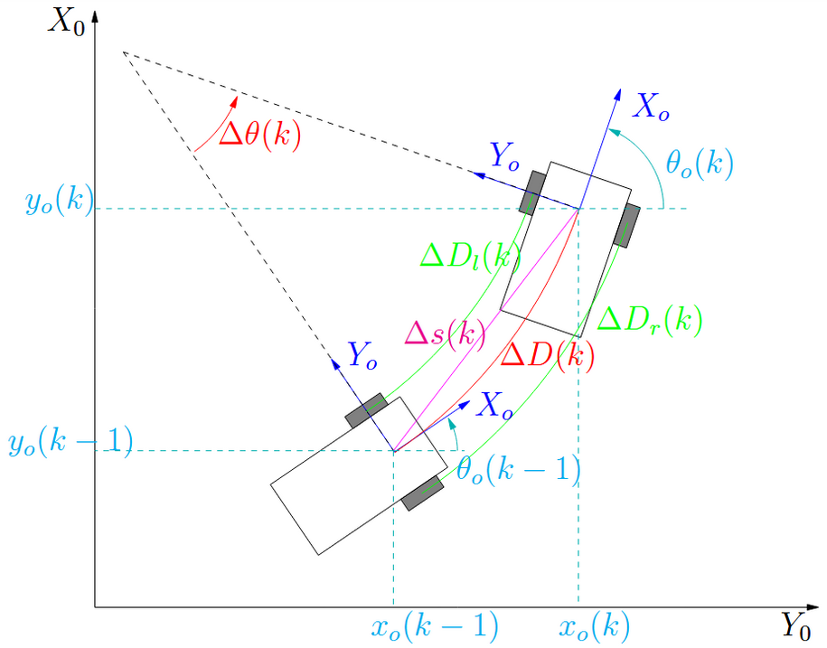

Etapa 1
#######

.. contents::
   :local:
   :depth: 2

Visão geral
***********

A etapa 1 se concentra como uma etapa de pesquisas, com o intuito de entender e selecionar a maneira de realizar as futuras etapas.

Desenvolvimento
***************

Apresentar o desenvolvimento da etapa contendo detalhes de implementação (se houver) de hardware e software. Adicionar pesqusisas realizadas bem como testes realizados.

Para a construção do projeto, primeiro deve-se entender o funcionamento dos sistemas utilizados, portanto pesquisas sobre o uso do ROS (Robot Operating System) foram realizadas, com tutoriais seguidos para a instalação em um computador próprio. Além da instalação inicial, houve estudos sobre a comunicação com o microcontrolador. Para a comunicação o método escolhido foi a comunicação com MQTT para um broker, então um script em python realiza a conversão para o ROS, conjunto com a biblioteca mqtt-client.

Tambem foi necessário o estudo sobre a odometria do robo, ou seja, como será feita a estimativa de posição dele, e consequentemente quais os tipos de dados que a comunicação do ROS utiliza para transmitir.

Testes
======

Para garantir a viabilidade do projeto, buscou-se já nesta etapa instalar e testar o ROS, no momento utilizando somente códigos de demonstração do mesmo. Seguindo o tutorial de instalação do ROS 2, foi instalada a versão mais recente, Kilted Kaiju, e então utilizada as demos de talker e listener.

Para validar a possibilidade de uso de MQTT foi feito um teste com código simulado para o envio até o broker. Os códigos de teste permitiram uma visualização básica no RViz.

Visualização
================================

Para testes iniciais foi utilizada o RViz, porém planeja-se utilizar o Gazebo como maneira de ver o robô se movimentando, seguindo 

Modelo Cinemático e Estimativa de Posição 
================================

Como o Juca foi projetado com uma configuração de tração diferencial, a base da nossa estimativa de posição (odometria) segue o modelo cinemático clássico para esse tipo de configuração. A ideia é usar a variação do movimento das rodas, captada pelos encoders de quadratura, combinada com a leitura de angulo do giroscópio MPU6050.

Aqui nós temos como definir uma equaçao recursiva onde a posiçao atual é a soma da posiçao anterior com a variaçao gerada após o Δt, que no caso é o período de amostragem::

   x(k) = x(k-1) + Δx(k)

A posiçao do carrinho pode ser separado em 3 variáveis diferentes, x e y representando os pontos no eixo 2D em que o robo irá percorrer e o θ representando o angulo do mesmo, no qual podemos representar de acordo com a formulaçao abaixo::

    x(k) = x(k-1) + Δs * cos(θ(k-1) + Δθ/2)
    y(k) = y(k-1) + Δs * sin(θ(k-1) + Δθ/2)
    θ(k) = θ(k-1) + Δθ

Tendo como ponto de referencia o momento inicial do carrinho.

O Δs representado no modelo é o movimento linear médio do carrinho::

   Δs(k) = ΔD(k) * [ sin(Δθ(k) / 2) / (Δθ(k) / 2) ]

Onde o ΔD é o comprimento do arco real, calculado pela média do deslocamento das rodas::

   ΔD(k) = 1/2  * (Δφe*r + Δφd*r) 

Nesta implementação, o valor de Δθ é obtido diretamente da IMU (MPU6050), o que minimiza erros acumulados por derrapagem das rodas.

Formato que pacotes de dados devem ser enviados para o computador
================================

No Juca a comunicação será realizada via micro-ROS. O envio dos pacotes segue uma estrutura de tópicos padronizada.

Estrutura de Dados: `nav_msgs/Odometry <https://docs.ros.org/en/noetic/api/nav_msgs/html/msg/Odometry.html>`_

   Header: Contém o Timestamp (tempo de sistema) e o Frame ID (referencial).

   Pose: Define a localização e orientação do robô no plano.

      Point (x, y, z): Indica a posição no eixo cartesiano. Para o Juca, consideramos apenas os eixos x e y (movimento em 2D).

      Quaternion (x, y, z, w): Representa a orientação. Os componentes x, y, z definem o eixo de rotação e a variável w indica a magnitude angular.

   Twist: Define as velocidades instantâneas do robô.

      Vector3 (Linear): Velocidade de translação no eixo x.

      Vector3 (Angular): Velocidade de rotação (yaw rate) no eixo z.

Graças ao processador interno (DMP - Digital Motion Processor) do MPU6050, o sensor já realiza a fusão de dados entre o acelerômetro e o giroscópio e nos entrega a orientação diretamente em Quaternions.

(Outras subseções se necessário)
================================

Referências (links/datasheets/livros)
*************************************

- `ROS 2 <https://www.ros.org/>`_
- `micro-ROS <https://micro.ros.org/>`_
- `ROS 2 - Instalação <https://docs.ros.org/en/kilted/Installation/Ubuntu-Install-Debs.html>`_
- `nav_msgs/Odometry <https://docs.ros.org/en/noetic/api/nav_msgs/html/msg/Odometry.html>`_
- `geometry_msgs/Pose Message <https://docs.ros.org/en/noetic/api/geometry_msgs/html/msg/Pose.html>`_
- `geometry_msgs/Twist Message <https://docs.ros.org/en/noetic/api/geometry_msgs/html/msg/Twist.html>`_
- `The ROS 2 Course <https://tom-howard.github.io/ros2/course/>`_
- `Implementação de Controladores no ROS 2 <https://www.ece.ufrgs.br/~fetter/cca99006/ros2_controllers_dynlin.pdf>`_
