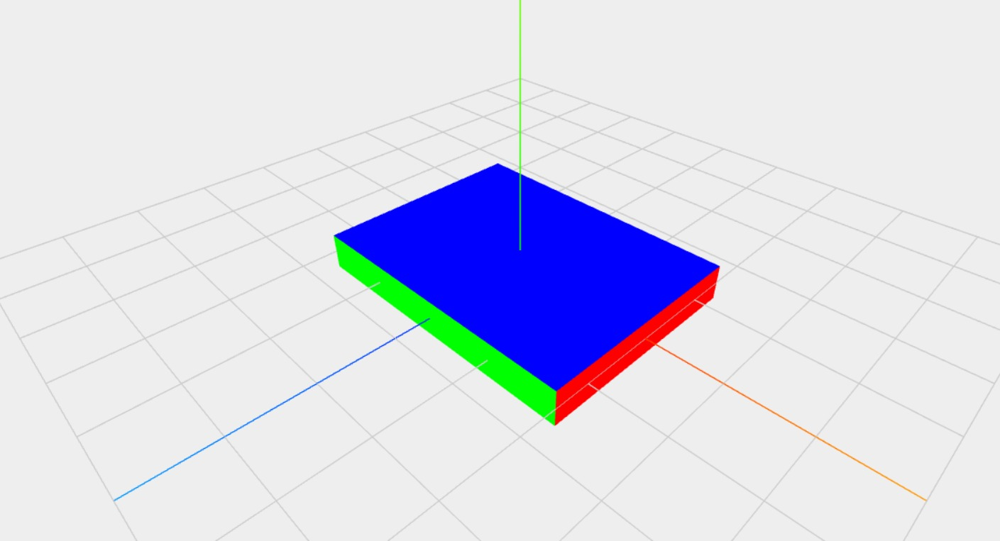
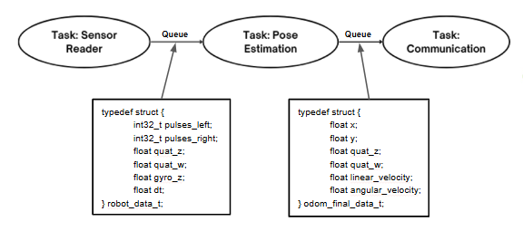
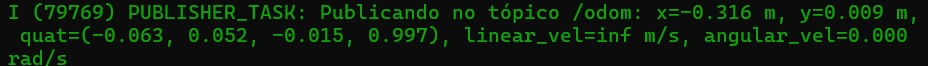
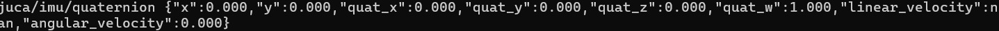

Etapa 2
#######

.. contents::
   :local:
   :depth: 2

Visão geral
***********

A etapa 2 começa o desenvolvimento do projeto, com estudo das bibliotecas aplicadas no projeto original, acréscimos à elas e então o seu uso para um protótipo inicial de fusão dos sensores.

Desenvolvimento
***************

Para a construção do projeto, primeiro buscou-se analisar sobre as bibliotecas já utilizadas, como 'bdc-motor' e a versão já disponível para o MPU-6050, encontradas no projeto original do robô `Juca <https://github.com/MatheusPinto/Juca>`_, desenvolvido pelo professor `Matheus Pinto <https://github.com/MatheusPinto>`_ do Instituto Federal de Santa Catarina. O mesmo código do projeto original foi utilizado para o teste dos sensores, garantindo o funcionamento dos mesmos.

Além do que já se encontrava presente, funções extras eram necessárias, então vieram acréscimos.

Bibliotecas
===========

Com a ideia inicial encontrada na primeira etapa, um quaternion se faz necessário para os cálculos de posição e para o recebimento no ROS. Além de fórmulas para o cálculo, o interesse no uso do Digital Motion Processor (DMP) do MPU-6050 surge, para obter os quaternions diretamente do sensor.

Buscas sobre o MPU-6050 trazem detalhes sobre seu DMP, entretanto não foram encontradas informações suficientes em datasheets para a construção de uma biblioteca, porém, encontrou-se uma biblioteca desenvolvida por `Jeff Rowberg <https://github.com/jrowberg>`_ chamada de `I2Cdev library collection <https://github.com/jrowberg/i2cdevlib>`_, com as funções necessárias. Então os detalhes desta biblioteca foram portadas para a estrutura utilizada já no projeto.

Além dos sensores, a comunicação com o computador passa a necessitar da biblioteca padrão da Espressif para conexão com a internet e a comunicação via MQTT.

Testes das Bibliotecas
======================

O uso de bibliotecas novas, além de mudanças na biblioteca do MPU-6050, demanda novos testes que agora alcancem estas tarefas.

O teste inicial foi uma modificação do projeto original do robô Juca, com a task do IMU o envio de dados para uma página funcionando na placa para a visualização do quaternion.
A página de teste utiliza também a biblioteca do JavaScript `Three.js <https://threejs.org/>`_ para a visualização do quaternion, mostrando um modelo 3D simples que se orienta conforme o quaternion, podendo este ser visto na imagem abaixo.

Para a comunicação com o MQTT, foi primeiro feito a forma inicial de fusão dos sensores.

Estimativa de Posição
=====================

Seguindo a estrutura pesquisada na primeira etapa, os dados obtidos do encoder e do giroscópio são utilizados para, com uma comparação de tempo, obter a variação de posição do robô, ou seja, a odometria.

É necessário realizar testes mais robustos para avaliar a necessidade de implementação de filtros digitais para melhorar a estimativa de posição e diminuir o erro agregado aos sensores.

Testes de Estimativas e MQTT
============================

Para o teste de ambas a estimativa de posição e a comunicação via MQTT, foi construido três tasks diferentes, uma responsável por ler os dados de ambos os sensores, outra responsável por calcular a odometria e a última responsável por enviar os dados para o broker MQTT, e temporariamente para a página de teste, para a visualização do resultado.
Esta estrutura utiliza queues para desbloquear as tasks seguintes, tendo o formato encontrado no gráfico abaixo.

O resultado obtido pode ser visto nas imagens abaixo, com a primeira apresentando os dados de uma estimativa de posição por meio da console, e a segunda apresentando os dados recebidos no broker MQTT, utilizando um cliente MQTT para se inscrever nos tópicos configurados e visualizar os dados recebidos, como a estimativa de posição.

Referências (links/datasheets/livros)
*************************************

- `Juca <https://github.com/MatheusPinto/Juca>`_
- `I2C Device Library <https://github.com/jrowberg/i2cdevlib>`_
- `ESP-MQTT <https://docs.espressif.com/projects/esp-idf/en/stable/esp32/api-reference/protocols/mqtt.html>`_
- `Espressif: Wi-Fi <https://docs.espressif.com/projects/esp-idf/en/stable/esp32/api-reference/network/esp_wifi.html>`_
- `Three.js <https://threejs.org/>`_

