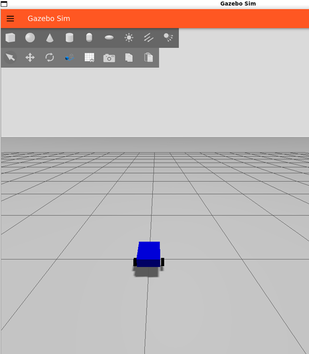

Etapa 3
#######

.. contents::
   :local:
   :depth: 2

Visão geral
***********

A etapa 3 concentra-se em aprimorar a fusão de sensores para a obtenção de dados mais próximos da realidade e a conexão e configuração do ROS para a tarefa desejada.

Desenvolvimento
***************

Considerando os focos da 3ª etapa, o desenvolvimento foi dividido em duas frentes, sendo uma direcionada aos dados retirados dos sensores, e outra direcionada a conexão, no computador, entre o ROS e o Gazebo, configurando o mesmo para o funcionamento desejado.

Visualização com Gazebo
=======================

Considerando o teste de visualização realizado no RViz durante a etapa 1, o formato inicial da forma de tratar dados do MQTT, enviados pelo robô, e os tópicos do ROS, já constroem um formato de trabalho, entretanto, a necessidade de novas construções, como a implementação de um filtro, para uso com os dados, e a visualização desejada sendo realizada no `Gazebo <https://gazebosim.org/docs/latest/getstarted/>`_, levam a mudanças em sua construção e comunicação.

Para o uso do Gazebo, foi feito um script Python que inicializa o mesmo, já preparando o 'robô' que aparece no ambiente virtual, este que é definido por um arquivo `.urdf <https://wiki.ros.org/urdf>`_ contendo sua aparência, dados de colisão e o plugin utilizado para permitir a modificação de sua posição e ângulo conforme a mudança detectada pelos sensores, `OdometryPublisher <https://gazebosim.org/api/sim/8/classgz_1_1sim_1_1systems_1_1OdometryPublisher.html>`_.

Filtro de Kalman Estendido
=======================

Os dados sensoriais foram separados na origem em dois tópicos ROS 2 independentes:

1. **`/odom` (`nav_msgs/msg/Odometry`):** Envia a posição linear ($X, Y$) e a velocidade linear calculadas puramente através dos encoders das rodas.
2. **`/imu/data` (`sensor_msgs/msg/Imu`):** Envia o ângulo absoluto ($Yaw$) e a velocidade angular no eixo vertical ($v_{yaw}$) medidos puramente pelo MPU6050.

Ao separar os tópicos e enviar estimativas puras, simplificamos a obtenção e o cálculo dos valores para as matrizes de covariância, uma vez que eliminamos qualquer interdependência ou correlação de erros entre os sensores na origem. Dessa forma, o EKF utiliza o modelo cinemático interno do robô para cruzar essas fontes independentes.

Implementação das Matrizes de Covariância no `ros_bridge.py`
=======================

No Filtro de Kalman, as diagonais das matrizes de covariância exigem a entrada da Variância ($\sigma^2$), que corresponde ao quadrado do desvio padrão ($\sigma$) medido na unidade correspondente de cada eixo (seja em metros para as posições lineares $X$ e $Y$, ou em radianos para as orientações angulares).

Matriz de Odometria (6x6 linearizada em array de 36 posições)
-------------------------------------------------------------

Construída seguindo o padrão nav_msgs/msg/Odometry. 

Como o robô opera em duas dimensões e o Filtro de Kalman já está configurado para desconsiderar os eixos tridimensionais no arquivo de configuração, mantemos as posições de Z, Roll e Pitch zeradas. Para as posições 0 ($X$), 7 ($Y$) e 35 ($Yaw$), realizamos os testes práticos para a obtenção de suas respectivas variâncias com base no comportamento físico das rodas:

.. code-block:: python

   # (x, y, z, rotation about X axis, rotation about Y axis, rotation about Z axis)
   p_cov = [0.0] * 36     # Criação da matriz de covariância
   p_cov[0] = 0.01        # X 
   p_cov[7] = 0.01        # Y 
   p_cov[35] = 0.01       # Yaw_enc

Matriz da IMU (3x3 linearizada em array de 9 posições)
------------------------------------------------------

Construída seguindo o padrão `sensor_msgs/msg/Imu`. 

Como o robô opera em duas dimensões, injetamos um ruído artificial (`99999.0`) em Roll e Pitch para forçar o filtro a descartá-los, já a posição 8 que se refere ao Yaw é necessário realizar testes para cálculo da sua variância:

.. code-block:: python

   imu_cov = [0.0] * 9     # Criação da matriz de covariância
   imu_cov[0] = 99999.0    # Roll (Valor alto p/ Bloquear/Ignorar)
   imu_cov[4] = 99999.0    # Pitch (Valor alto p/ Bloquear/Ignorar)
   imu_cov[8] = 0.01       # Yaw (Confiança Prioritária)

Testes
======

Para garantir o funcionamento das construções realizadas no Gazebo, foi construído versões alternativas das transmissões de dados, utilizando dados gerados para testes, a instalação das partes necessárias aos testes e o seu uso, se encontra em `Testes <Tests.rst>`_

Referências (links/datasheets/livros)
*************************************

- `Gazebo <https://gazebosim.org/docs/latest/getstarted/>`_
- `.urdf <https://wiki.ros.org/urdf>`_
- `OdometryPublisher <https://gazebosim.org/api/sim/8/classgz_1_1sim_1_1systems_1_1OdometryPublisher.html>`_
- `Wiki Robot_Localization <https://docs.ros.org/en/noetic/api/robot_localization/html/index.html>`_
- `Template EKF.yaml <https://github.com/cra-ros-pkg/robot_localization/blob/rolling-devel/params/ekf.yaml>`_
- `Artigo sobre Matriz de Covariância <https://robotxworkshops.tech/robotics-course-in-berlin/>`_

