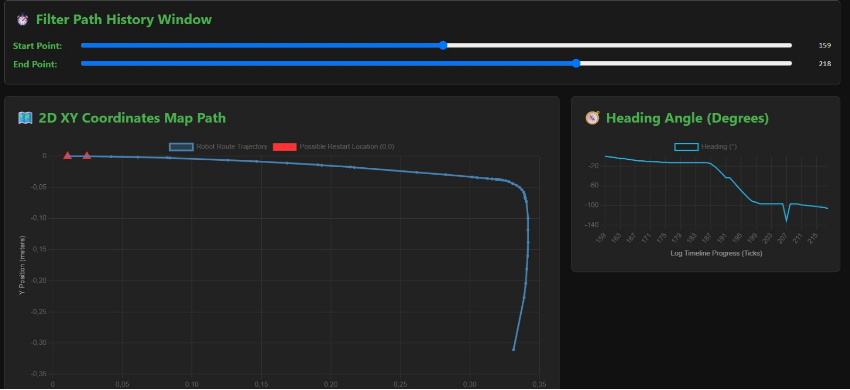
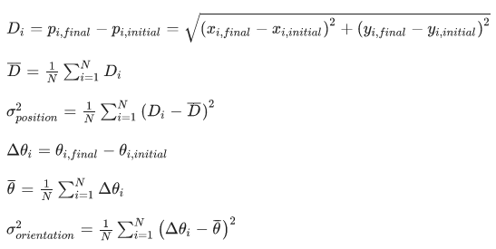
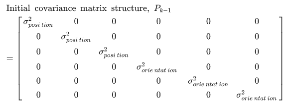

Etapa 4
#######

.. contents::
   :local:
   :depth: 2

Visão geral
***********

Iniciamos a etapa 4 com a calibração do PPR dos motores através da análise direta no osciloscópio, corrigindo os erros de escala na odometria. Em seguida, foi implementada a visualização de trajetória em HTML utilizando os logs gerados para permitir a comparação dos dados. Por fim foi realizado os testes de localização para a calibração inicial do Filtro de Kalman, baseando-se no artigo "Initial covariance estimation and analysis for EKF localization using route-based experimental data" através de sequências repetitivas de movimentos.

Calibração do PPR
***************

Para melhorar a estimativa de distância linear, realizamos uma análise de sinal nos encoders utilizando um osciloscópio. Através da observação dos pulsos durante deslocamentos controlados, foi possível determinar com precisão o valor de 900 PPM (Pulsos por Metro). Este valor foi implementado no firmware para garantir que a conversão de ticks para metros reflita a realidade mecânica do robô.

Script para visualização de trajetória
***************************

Além da visualização em tempo real no Gazebo, criamos um script em Python que utiliza os logs gerados pelo ROS para comparar os dados brutos de estimativa com os resultados do Filtro de Kalman.

A figura acima apresenta um exemplo de visualização de trajetória, sendo possível delimitar o intervalo.

Testes e Calibração do Filtro de Kalman
***************************

Para os testes de localização, focamos na execução de rotas quadradas repetitivas, o que permitiu avaliar o acúmulo de erro tanto em linha reta quanto em curvas de 90 graus. A montagem das matrizes de covariância seguiu rigorosamente o método de cálculo do artigo de referência, que ensina a mapear estatisticamente as incertezas para que o filtro funcione. O cálculo da variância foi feito coletando um conjunto de 10 amostras consecutivas do sensor e aplicando a fórmula matemática clássica da variância demonstrado abaixo. 

Onde subtraímos cada leitura individual da média aritmética de todas as leituras, elevamos o resultado ao quadrado para eliminar sinais negativos, somamos todas essas diferenças quadráticas e dividimos o total pelo número de amostras menos um (N-1).

Acima temos a matriz de covariância inicial do filtro ekf, onde a diagonal principal representa a variancia nos eixos x, y, z, roll, pitch e yaw, os outros elementos da matriz representam a covariancia, ou seja, uma relação mais complexa entre 2 elementos, no qual o próprio filtro realiza suas alterações.

Durante a execução das rotas quadradas, medimos fisicamente em cada volta o erro, que é a diferença entre a coordenada onde o robô finalizou o percurso e o ponto de origem real onde ele deveria ter parado. Ao registrar esse desvio ao longo de várias voltas, conseguimos calibrar o ganho do Filtro de Kalman, garantindo que a trajetória corrigida se mantivesse estável.

Referências (links/datasheets/livros)
*************************************

- `Artigo de Referência "Initial covariance estimation and analysis for EKF localization using route-based experimental data" <https://www.sciencedirect.com/science/article/pii/S2773186326000496?fr=RR-2&ref=pdf_download&rr=a171fd8e0e817df3>`_

